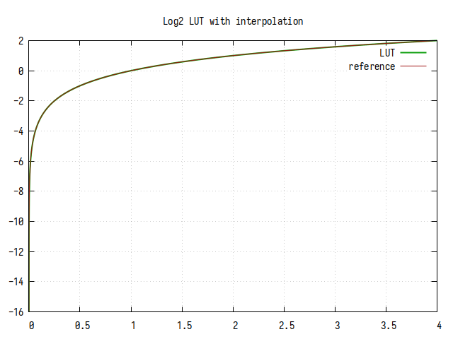
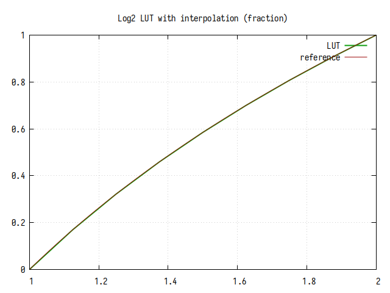
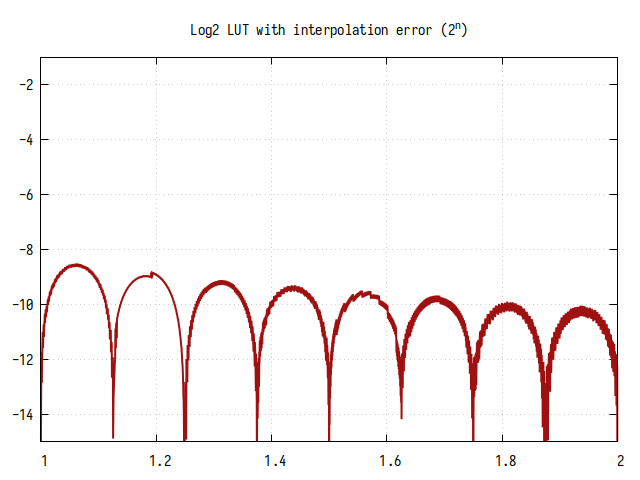
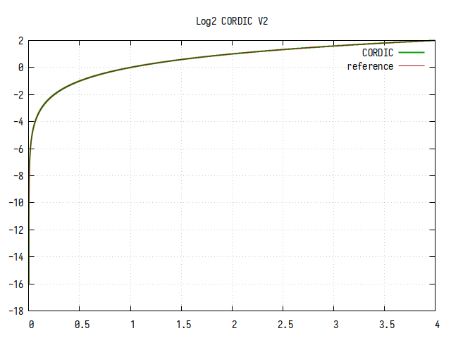

# Поточное вычисление двоичного логарифма

В статье рассматриваются варианты реализации поточного вычисления двоичного
логарифма, приводятся результаты измерения точности и ресурсоёмкости для ПЛИС
**Artix-7** и синтезатора **Vivado 2020.2**.

Было протестировано 3 алгоритма вычисления *log2(x)* с некоторыми вариациями:

1.  Алгоритм с линейной интерполяцией дробной части;
2.  Табличный алгоритм без интерполяции промежуточных значений и с интерполяцией;
3.  Алгоритм CORDIC в вариантах без повторения шагов, с двойным повторением и с
    частичным повторением.

Все алгоритмы основаны на том, что *log2(x * 2^n) = log2(x) + n)*. Т.е. задача
вычисления двоичного логарифма сводится к приведении агрумента к интервалу [1..2)
(нормализация) умножением/делением на 2 или двоичным сдвигом, и вычислении дробной
части. Целой частью логарифма будет количество умножений/делений (сдвигов),
необходимых для нормализации. Алгоритмы, показанные в статье, выполняют вычисление
дробной части.

## Обзор

### Нормализация агрумента

Алгоритм нормализации одинаков для всех вариантов вычисления логарифма и
реализован в виде операции логарифмического сдвига, что быстрее и менее
ресурсоёмко наивного побитового сдвига или приоритетного шифратора.

Алгоритм нормализации 16-битного числа в псевдокоде:

    n = 0;
    if ((x & 16'b1111_1111_0000_0000) == 0) { x = x << 8; n = n + 8; }
    if ((x & 16'b1111_0000_0000_0000) == 0) { x = x << 4; n = n + 4; }
    if ((x & 16'b1100_0000_0000_0000) == 0) { x = x << 2; n = n + 2; }
    if ((x & 16'b1000_0000_0000_0000) == 0) { x = x << 1; n = n + 1; }

На выходе получаем сдвинутое к левому краю число и количество битовых сдвигов.

Пример:

    x = 16'b0000_0000_0101_0001
    n = 0

    Шаг 1:
    b0000_0000_0101_0001 &
    b1111_1111_0000_0000 =
    b0000_0000_0000_0000 == 0

    x = x << 8 = b0101_0001_0000_0000
    n = n + 8 = 8

    Шаг 2:
    b0101_0001_0000_0000 &
    b1111_0000_0000_0000 =
    b0101_0000_0000_0000 != 0

    Шаг 3:
    b0101_0001_0000_0000 &
    b1100_0000_0000_0000 =
    b0100_0000_0000_0000 != 0

    Шаг 4:
    b0101_0001_0000_0000 &
    b1000_0000_0000_0000 =
    b0000_0000_0000_0000 == 0

    x = x << 1 = b1010_0010_0000_0000
    n = n + 1 = 9

Для получения целой части логарифма нужно вычесть число *n+1* из количества бит целой части
входного числа. Общий результат получается суммированием целой части и дробной.

Например, пусть число из примера выше представлено в формате **Q4.12**, т.е. 4 бита
целой части, и 12 бит дробной. Разность *4-(n+1)* равна -6. Прибавлением дробной
части к -6 получим результат между -6 и -5.

Нормализованое число представлено в формате **Q1.15**, т.к целая часть всегда равна
единице. Диапазон значений - *[1..2)*. Из значения дробной части числа вычисляется
дробная часть логарифма.

### Алгоритм с линейной интерполяцией дробной части

Это самый простой, но в то же время самый неточный алгоритм. Для вычисления логарифма
просто берется дробная часть нормализованного числа и конкатенируется с целой частью
логарифма.

Возьмём число из примера выше:

    x = 16'b0000.0000_0101_0001

Его десятичное предствление и значение функции *log2(x)*:

    x = 16'b0000.0000_0101_0001 ≈ 0.019775390625
    log2(0.019775390625) ≈ -5.660149997

После нормализации получаем:

    x = b1.010_0010_0000_0000
    n = 9
    e = 4-(9+1) = -6 = b11010

Соединяем *e* и дробную часть нормализованного *x*:

    y = b11010.010_0010_0000_0000 = -5.734375

Как можно видеть, ошибка вычисления составила 0.0742 (из приведенных ниже таблиц
будет видно, что эта ошибка близка к максимальной). При вычислении этим способом
значения децибел (*20 * log10(x)*) ошибка будет составлять примерно 0.45dB, что для
некоторых применений вполне приемлемо (ниже будет показано, как можно улучшить
точность этого метода в два раза).

### Табличный алгоритм

В табличном способе дробная часть логарифма берется из заранее созданной таблицы
значений *log2(x)* в интервале *[1..2)*. В ПЛИС таблица реализуется в виде ROM с
адресацией по дробной части нормализованного числа. Разрядность ROM (длина таблицы)
выбирается из требуемой точности вычислений.

В улучшенном табличном алгоритме выполняется линейная интерполяция между точками
табличных значений. Для этого берутся оставшиеся после адреса ROM биты дробной части
нормализованного числа, и умножаются на коэффициент, равный разности следующего и
текущего значений из таблицы. Т.к. в потоковой реализации мы не можем два раза
прочитать значение из ROM, целесообразно создать еще одну ROM с предвычисленными
значениями коэффициентов для каждой точки, т.к. иначе придется продублировать ROM со
значениями log2 и добавить сумматор.

Вот как это выглядит на примере (пусть разрядность ROM будет равна 6 битам):

    x = 16'b0010.010110010010 = 2.34814453125
    log2(x) = 1.231521211

    x(norm) = b1.0010110010010000
                 |    ||        |
                 +----++--------+
                  ROM      z
                  addr

    rom_addr = b001011 = 11
    z = b.0010010000 = 0.140625
    e = 4-(2+1) = 1

    l = ROM_log2(11) = 0.2288186905
    k = ROM_k(11) = ROM_log2(12) - ROM_log2(11) = 0.0191088229

    log2(x) = e + l + k * z = 1.2315058687

Ошибка вычисления составила 0.00001534

### Алгоритм CORDIC

Алгоритм основан на последовательном приближении агрумента функции *log2(x)* к
единице с одновременным пересчетом результата функции путем прибавления или вычитания
заранее вычисленных значений *log2(x)*, соответствующих множителю агрумента. Чтобы не
использовать умножение, в методе CORDIC применяется битовый сдвиг, который
эквивалентен умножению/делению на 2.

В основе алгоритма следующая формула:

    log(a * (1±k)) = log(a) + log(1±k) = y + log(1±k)

Алгоритм в псевдокоде выглядит так:

    k = 0.5
    e, x = normalize(a) // e - количество сдвигов, x - нормализованный аргумент

    loop(STEPS)
    {
        if (x >= 1) {
            x = x * (1-k)
            e = e - log2(1-k)
        }
        else {
            x = x * (1+k)
            e = e - log2(1+k)
        }

        k = k / 2
    }

    return e

Этот алгоритм можно оптимизировать. Т.к. *x* всегда больше единицы, можно сразу
разделить его на два, а к *e* прибавить единицу. Можно заметить, что после этого *x*
всегда будет меньше единицы. Т.е. за цикл можно вынести первую итерацию, и совместить
это с предыдущим действием:

    x = x/2 + x/4
    y = y + 1 - np.log2(1+0.5)
    k = 1/4

Этот код нужно вставить перед циклом. Такая оптимизация улучшает сходимость и
позволяет избавиться от одного сложения.

При некоторых начальных значениях *x* недостаточно приближается к единице, из-за чего
падает точность вычислений. Улучшить сходимость помогает повторное вычисление шага с
тем же значением *k*. Это можно делать на каждом шаге, но, как будет показано далее,
лучший результат даёт выборочное повторение шагов.

## Результаты моделирования

При моделировании использовались следующие параметры:

| Параметр                      |    |
|-------------------------------|----|
| Входная разрядность           | 18 |
| Длина дробной части на входе  | 16 |
| Выходная разрядность          | 18 |
| Длина дробной части на выходе | 12 |

Для каждого метода приведены следующие графики:

1.  График вычисленного и референсного значений лорагифма на интервале 0..4;
2.  График вычисленного и референсного значений лорагифма на интервале 1..2;
3.  График абсолютной ошибки на интервале 1..2 в логарифмическом масштабе.

*Размер таблицы для табличного алгоритма и количество стадий для CORDIC выбраны таким
образом, чтобы точности алгоритмов были близки.*

### Алгоритм с линейной интерполяцией дробной части

| Параметр                            | Значение    |
|-------------------------------------|-------------|
| Максимальная абсолютная ошибка      | 0.04332992  |
| Значащих бит в дробной части (мин)  | 4.53        |
| Значащих бит в дробной части (сред) | 5.25        |
| Максимальная ошибка вычисления dB:  | 0.260872 db |

 
<b>Рис.1: График log2(x), вычисленного методом линейной интерполяции</b>

На графике хорошо заметны линейные участки между степенями двойки по оси X.

 
<b>Рис.2: График log2 на интервале 1..2</b>

Как видно из графика, дробная часть логарифма представляет собой линейное приближение
к референсному значению. В представленной реализации, для улучшения точности, к
результирующему значению прибавляется константа 0.043. Это добавляет лишний сумматор,
но улучшает точность в два раза.

 
<b>Рис.3: Ошибка вычисления</b>

В худшем случае точность вычисления составляет примерно 4.5 бита в дробной части, но
в окрестностях точек пересечения прямой и *log2(x)* (примерно 1.12 и 1.82) точность
приближается к максимальной.

### Табличный алгоритм без интерполяции

Размер таблицы - 256 элементов (разрядность 8 бит).

| Параметр                            | Значение    |
|-------------------------------------|-------------|
| Максимальная абсолютная ошибка      | 0.00292969  |
| Значащих бит в дробной части (мин)  | 8.42        |
| Значащих бит в дробной части (сред) | 10.00       |
| Максимальная ошибка вычисления dB:  | 0.017638 db |

 
<b>Рис.4: График log2(x), вычисленного табличным методом без интерполяции</b>

 
<b>Рис.5: График log2 на интервале 1..2</b>

На общем графике погрешностей вычисления не заметно, однако на интервале 1..2 можно
заметить ступеньки, возникающие из-за конечного размера таблицы подстановки.

 
<b>Рис.6: Ошибка вычисления</b>

Среднее количество значащих бит дробной части равно 10, и имеет небольшой спад в
начале интервала, и подъем в конце. Это обусловлено разностью значений производной
логарифма - в начале интервала она имеет большее значение, чем в конце, тогда как
значения таблицы распределены равномерно. Если посмотреть на график ошибки на всех
значениях *X*, то будет видно, что кривая повторяется на каждом интервале от *2^n* до
*2^(n+1)*.

### Табличный алгоритм с интерполяцией

Размер таблицы - 8 элементов (разрядность 3 бита).

| Параметр                            | Значение    |
|-------------------------------------|-------------|
| Максимальная абсолютная ошибка      | 0.00274294  |
| Значащих бит в дробной части (мин)  | 8.51        |
| Значащих бит в дробной части (сред) | 9.92        |
| Максимальная ошибка вычисления dB:  | 0.016514 db |

 
<b>Рис.7: График log2(x), вычисленного табличным методом с интерполяцией</b>

 
<b>Рис.8: График log2 на интервале 1..2</b>

На интервале 1..2 едва заметны 8 линейных участков.

 
<b>Рис.9: Ошибка вычисления</b>

Среднее кол-во значащих бит дробной части около 10. Ошибка вычисления представляет
собой произведение табличной ошибки и ошибки линейной интерполяции на 8
интервалах. На графике чётко видны 8 "колоколов", как в алгоритме линейной
интерполяции, а так же уменьшение ошибки с увеличением *X*, как в табличном без
интерполяции. Небольшие флуктуации на графике обусловлены конечной разрядностью
выходного кода.

### Алгоритм CORDIC без дублирования шагов

Количество шагов - 12.

| Параметр                            | Значение    |
|-------------------------------------|-------------|
| Максимальная абсолютная ошибка      | 0.06852803  |
| Значащих бит в дробной части (мин)  | 3.87        |
| Значащих бит в дробной части (сред) | 8.52        |
| Максимальная ошибка вычисления dB:  | 0.412580 db |

 
<b>Рис.10: График log2(x), вычисленного алгоритмом CORDIC</b>

 
<b>Рис.11: График log2 на интервале 1..2</b>

В целом, алгоритм CORDIC обеспечивает очень хорошее приближение к референсному
значению, кроме участков плохой сходимости, которые видны на графиках в виде
выбросов. Видно, что кроме больших участков плохой сходимости есть участки поменьше и
еще меньше, что похоже на фрактальный рисунок.

 
<b>Рис.12: Ошибка вычисления</b>

Если бы не выбросы, точность вычисления логарифма была бы более 10 двоичных знаков в
дробной части.

### Алгоритм CORDIC с дублированием каждого шага

Количество шагов - 12, значение k повторяется по два раза.

| Параметр                            | Значение    |
|-------------------------------------|-------------|
| Максимальная абсолютная ошибка      | 0.01168009  |
| Значащих бит в дробной части (мин)  | 6.42        |
| Значащих бит в дробной части (сред) | 7.48        |
| Максимальная ошибка вычисления dB:  | 0.070321 db |

 
<b>Рис.13: График log2(x), вычисленного алгоритмом CORDIC с полным дублированием</b>

 
<b>Рис.14: График log2 на интервале 1..2</b>

Из-за дублирования всех шагов, минимальный шаг приближения уменьшился в 64 раза (при
12 шагах всего, только на 6 шагах коэффициент *k* уменьшается в два раза), что
сказалось на точности вычисления. Однако, выбросов, обусловленных плохой сходимостью
не осталось.

 
<b>Рис.15: Ошибка вычисления</b>

Ошибка вычисления равномерная и постоянная, хоть и довольно высокая.

### Алгоритм CORDIC с частичным дублированием

Количество шагов - 12, дублируются шаги 3, 5 и 7.

| Параметр                            | Значение    |
|-------------------------------------|-------------|
| Максимальная абсолютная ошибка      | 0.00211954  |
| Значащих бит в дробной части (мин)  | 8.88        |
| Значащих бит в дробной части (сред) | 10.42       |
| Максимальная ошибка вычисления dB:  | 0.012761 db |

 
<b>Рис.16: График log2(x), вычисленного алгоритмом CORDIC с частичным дублированием</b>

 
<b>Рис.17: График log2 на интервале 1..2</b>

Если присмотреться, можно увидеть небольшие ступеньки на графике. Они меньше, чем в
предыдущем варианте, но больше, чем в варианте без дублирования.  Минимальный шаг
приближения увеличился в 8 раз по сравнению с первым вариантом, но он меньше в 8 раз,
чем во втором варианте.

 
<b>Рис.18: Ошибка вычисления</b>

Видно, что ошибка в целом равномерная и постоянная. Небольшие флуктуации появились
из-за конечной разрядности выходного кода и из-за присутствия участков, где
сходимость всё таки не полностью достигается. Тем не менее, среднее количество
значащих бит около 10, и оно не зависит от аргумента.

## Результаты синтеза

Синтез и трассировка проводились синтезатором **Vivado 2020.2** для ПЛИС
**Artix-7a35** со стандартными настройками. Все варианты синтезировались с
одинаковыми значениями ширины входного и выходного слова:

| Параметр                      | Значение |
|-------------------------------|----------|
| Входная разрядность           | 18       |
| Длина дробной части на входе  | 16       |
| Выходная разрядность          | 18       |
| Длина дробной части на выходе | 12       |

Ниже представлены таблицы с результатами синтеза и моделирования.

Расшифровка названий строк в таблицах:

| Название    | Расшифровка                                         |
|-------------|-----------------------------------------------------|
| LUT         | Количество LUT                                      |
| FF          | Количество триггеров                                |
| BRAM        | Количество блоков памяти                            |
| DSP         | Количество блоков DSP                               |
| FMAX        | Максимальная частота клока (МГц)                    |
| Latency     | Задержка между входным значением и результатом      |
| Макс.ошибка | Максимальная абсолютная ошибка вычисления логарифма |
| SFB среднее | Среднее количество значащих бит дробной части       |

### Алгоритм с линейной интерполяцией дробной части

Метод линейной интерполяции не имеет параметров и вариантов исполнения, по этому в
таблице только один столбец.

|             |       |
|-------------|-------|
| LUT         | 69    |
| FF          | 132   |
| BRAM        | -     |
| DSP         | -     |
| FMAX        | 320   |
| Latency     | 8     |
| Макс.ошибка | 0.043 |
| SFB среднее | 5.25  |

Комментировать здесь в общем нечего.

### Табличный алгоритм без интерполяции

Был выполнен синтез нескольких вариантов модуля с разными размерами таблицы (указаны
в шапке).

| Размер таблицы: | 64    | 128    | 256    | 512    | 1024    | 2048    |
|-----------------|-------|--------|--------|--------|---------|---------|
| LUT             | 62    | 77     | 101    | 153    | 62      | 64      |
| FF              | 91    | 95     | 99     | 103    | 85      | 87      |
| BRAM            | -     | -      | -      | -      | 0.5     | 1       |
| DSP             | -     | -      | -      | -      | -       | -       |
| FMAX            | 370   | 338    | 317    | 278    | 319     | 318     |
| Latency         | 7     | 7      | 7      | 7      | 7       | 7       |
| Макс.ошибка     | 0.011 | 0.0056 | 0.0029 | 0.0015 | 0.00079 | 0.00046 |
| SFB среднее     | 8.00  | 9.00   | 10.00  | 10.98  | 11.96   | 12.85   |

Синтез табличного алгоритма сильно удивил тем, что таблицу до 512 элементов
синтезатор реализовал в виде логики, при этом уместив всё в скромные 100-150
LUT. Необычно еще то, что количество триггеров получилось заметно меньше, чем в
алгоритме линейной интерполяцией.

### Табличный алгоритм с интерполяцией

| Размер таблицы: | 8      | 16      | 32      | 64      |
|-----------------|--------|---------|---------|---------|
| LUT             | 86     | 91      | 89      | 98      |
| FF              | 148    | 150     | 150     | 150     |
| BRAM            | -      | -       | -       | -       |
| DSP             | 1      | 1       | 1       | 1       |
| FMAX            | 312    | 326     | 338     | 360     |
| Latency         | 9      | 9       | 9       | 9       |
| Макс.ошибка     | 0.0027 | 0.00093 | 0.00049 | 0.00046 |
| SFB среднее     | 9.92   | 11.47   | 12.53   | 12.84   |

Табличный алгоритм с интерполяцией показал, пожалуй, лучший результат по соотношению
ресурсы/точность, хоть и потребовал одного умножителя. Кроме того, в реализации есть
возможность оптимизации для более полного использования ресурсов умножителя, что
может уменьшить количество триггеров.

### Алгоритм CORDIC без дублирования шагов

Для алгоритма CORDIC варьировалось количество шагов.

| Итерации:   | 10    | 12    | 14    |
|-------------|-------|-------|-------|
| LUT         | 356   | 424   | 458   |
| FF          | 416   | 490   | 546   |
| BRAM        | -     | -     | -     |
| DSP         | -     | -     | -     |
| FMAX        | 320   | 300   | 328   |
| Latency     | 16    | 18    | 20    |
| Макс.ошибка | 0.068 | 0.068 | 0.068 |
| SFB среднее | 8.27  | 8.52  | 8.55  |

Блок занимает в разы больше ресурсов, чем предыдущие варианты из-за большого
количества стадий конвейера. Как было сказано ранее, просадка в точности в этом
варианте происходит из-за плохой сходимости на некоторых значениях аргумента.

### Алгоритм CORDIC с дублированием каждого шага

| Итерации:   | 10    | 12    | 14     |
|-------------|-------|-------|--------|
| LUT         | 356   | 422   | 489    |
| FF          | 417   | 491   | 565    |
| BRAM        | -     | -     | -      |
| DSP         | -     | -     | -      |
| FMAX        | 329   | 287   | 304    |
| Latency     | 16    | 18    | 20     |
| Макс.ошибка | 0.023 | 0.012 | 0.0062 |
| SFB среднее | 6.49  | 7.48  | 8.47   |

Количество ресурсов в этом варианте практически не изменилось, но точность выросла
из-за хорошей сходимости.

### Алгоритм CORDIC с дублированием в точках 3, 7, 11

| Итерации:   | 6     | 8      | 10    | 12    | 14     |
|-------------|-------|--------|-------|-------|--------|
| LUT         | 225   | 291    | 358   | 423   | 490    |
| FF          | 268   | 342    | 416   | 490   | 564    |
| BRAM        | -     | -      | -     | -     | -      |
| DSP         | -     | -      | -     | -     | -      |
| FMAX        | 313   | 326    | 323   | 330   | 328    |
| Latency     | 12    | 14     | 16    | 18    | 20     |
| Макс.ошибка | 0.049 | 0.0149 | 0.006 | 0.002 | 0.0014 |
| SFB среднее | 5.48  | 7.45   | 8.47  | 10.42 | 11.24  |

Этот вариант показал лучшую точность при всех значениях количества шагов.

CORDIC показал худшие результаты по ресурсам. В то же время, у него лучшая
равномерность ошибки, что может быть полезно в каких-то сценариях применения.

## Выводы

Самым эффективным с точки зрения ресурсов и скорости оказался табличный алгоритм с
интерполяцией. А его вариант без интерполяции и с размером таблицы до 512 не
нуждается в использовании BRAM или умножителя и показывает приемлемые результаты по
точности.

Алгоритм линейной интерполяции, несмотря на его простоту, оказался не самым лучшим с
точки зрения ресурсов. Однако, возможно показанную реализацию можно оптимизировать.

Из-за медленной сходимости приближения в алгоритме CORDIC необходимо увеличивать
количество шагов приближения, что, с учётом потоковой реализации, требует большого
количества ресурсов. Несмотря на это, итерационная реализация может показать хорошие
результаты как по точности, так и по ресурсам. Кроме того, этот метод имеет самую
равномерную ошибку вычисления, что может быть важно в некоторым случаях. Еще одно
преимущество алгоритма в том, что он не использует умножители.

## Приложение

Исходники: https://github.com/punzik/log2pipelined
